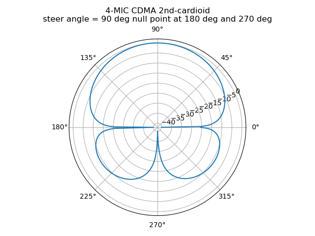
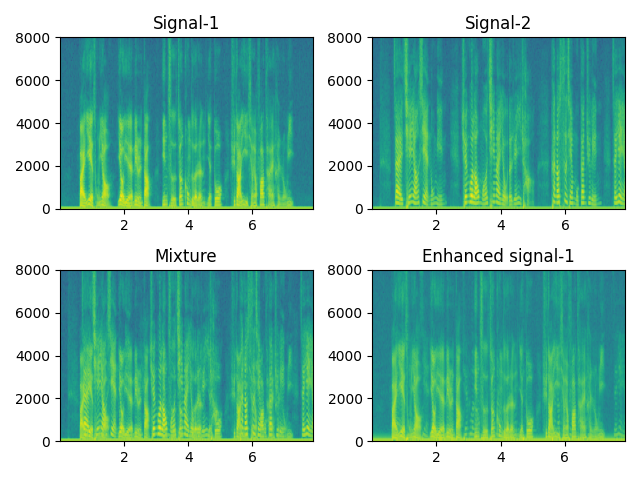

# CDMA
Generate weights for Differential Microphone Arrays (CDMA)[1] in Python.  
生成圆阵列DMA算法的波束成形权重，具体设计参考Jacob的《Design of circular differential microphone arrays》。  
  


## 2-STEP TO USE:
```
cma     = circular_microphone_arrays(M=4)
cdma    = CDMA(cma, sa=180, null_list=[180 + 135])
```
1) Define `circular_microphone_arrays` base on geometry of your microphone array, eg: `r` for radius (cm), `M` for the number of microphones. For now, only uniform circular array (UCA) is supported.  
2) Design your CDMA base on your microphone array, including `sa` for steer angle, `null_list` for null point list and `sym` for the symmetry of H.
The order of CDMA depends on `null_list`. 
For `sym`, you can see *Section 2.1* and *Section 2.2* in [1] for help.  
  

## TO ENHANCE A SPEECH SIGNAL:  
In `test.py`, an example demonstrates how to apply the CDMA build before on speech enhancement task. Two utterances from [THCHS30](www.openslr.org/18/) are mixed ( you need to download dataset by yourself ). And we try to enhance the signal-1 from the mixed signal. The performance are evaluated on data generated by pyroomacoustic.  
The specgram of clean utterances, mixture and enhanced signal are shown below.  


## AVAILABLE CDMA TYPE
- Any order Hypercardioid, Supercardioid or Cardioid CDMA
- Superdirective, Robust Superdirective w/o symmetry or null point constraint
  
## Reference:  
[1] Benesty, Jacob, Jingdong Chen, and Israel Cohen. Design of circular differential microphone arrays. Vol. 12. Berlin, Germany:: Springer, 2015.
